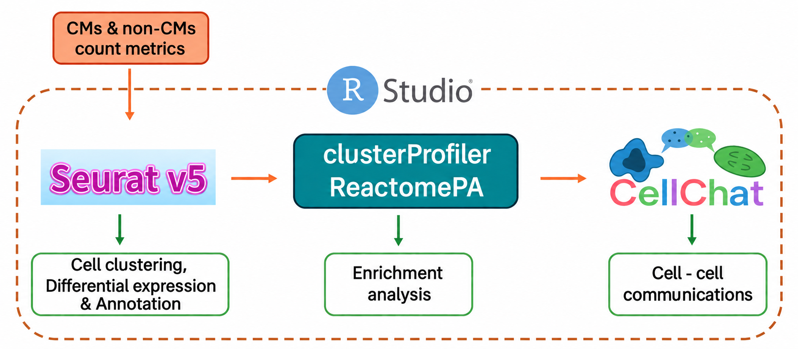

# Cardiomyocyte Maturation scRNA-seq Analysis

This project analyzes published neonatal mouse heart scRNA-seq and snRNA-seq data 
to investigate changes in cardiomyocytes (CMs) during maturation from day 2 to day 11 
of neonatal life, focusing on **transcriptional changes** and **intercellular communication**
between CMs and other cardiac cell types.

The analysis workflow is implemented in **RStudio** using **Seurat**, **clusterProfiler**,
**ReactomePA**, and **CellChat**.

  

  The data analysis pipeline and libraries used in this study.

### Project Report

The complete project report is available
[**here**](Report/Diep_Thai_REPORT_F1_MOLEBIO.pdf).